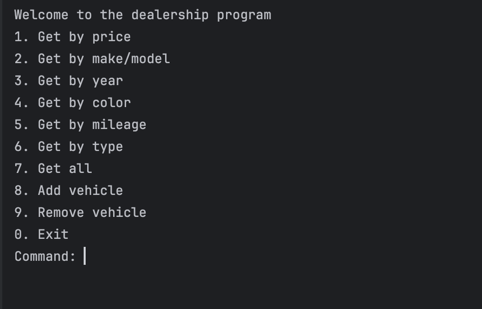
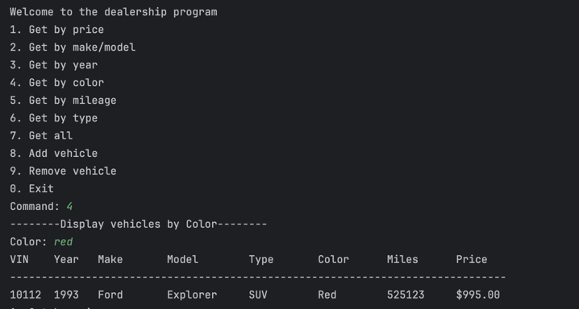
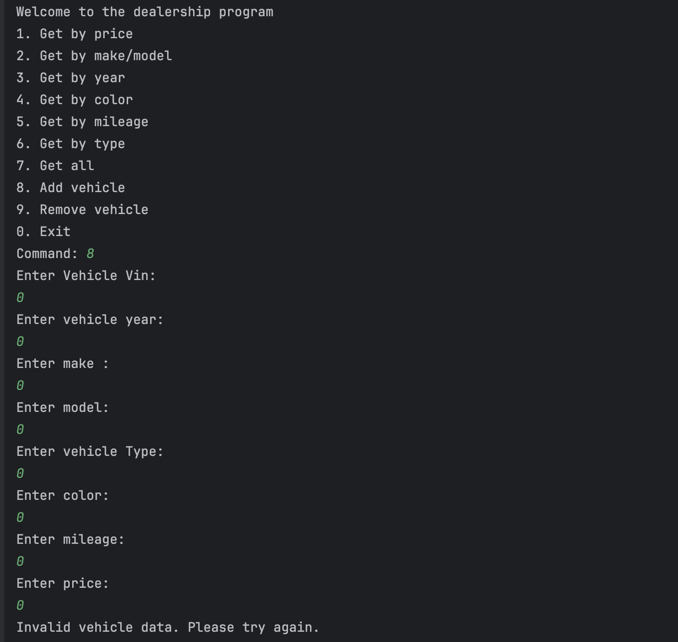

# WorkShop Four CarDealership
#### By: Sheik Siphat

## Key Features
🔍 Features
This Dealership Console Application allows users to easily browse and manage a vehicle inventory through an interactive, menu-based system.

Below are the key features, many of which are shown in the screenshots:

🚘 Filter & Search Vehicles
Get by Price
Enter a minimum and maximum price range to view all vehicles within that budget.

Get by Make/Model
Search for a specific car brand and model (e.g., Honda Civic).

Get by Year
View vehicles manufactured within a specific year range.

Get by Color
Filter cars by paint color (e.g., Red, Black).

Get by Mileage
Enter a mileage range to find cars with appropriate wear.

Get by Type
Narrow results by vehicle type (e.g., SUV, Sedan, Truck).

Get All Vehicles
Instantly display all vehicles in the dealership’s inventory.

➕ Add & Remove Vehicles
Add Vehicle
Input vehicle details like VIN, year, make, model, type, color, mileage, and price.
The new vehicle is added to the inventory and saved to file.

Remove Vehicle
Delete a vehicle from the inventory by entering its VIN number.

🧾 Clean Display
Search results are presented in a neatly formatted table showing:

VIN    Year   Make      Model       Type       Color      Miles      Price
-----------------------------------------------------------------------------
10112  1993   Ford      Explorer    SUV        Red        525123     $995.00

## Screenshots of display

# Outstanding features:

## 1) Testing each cases  

@Test
void vehiclesByPriceShouldReturnPriceWithinSpecifiedRange() {

    //Arrange
    Dealership dealership =new Dealership("Test Dealer", "123 Road", "555-5555");
    dealership.addVehicle(new Vehicle(1001, 2020, "Toyota", "Camry", "Sedan", "Black", 45000, 15000.00));
    dealership.addVehicle(new Vehicle(1002, 2018, "Honda", "Civic", "Sedan", "White", 60000, 12000.00));
    dealership.addVehicle(new Vehicle(1003, 2022, "Ford", "Explorer", "SUV", "Red", 20000, 28000.00));

    //Act
    ArrayList<Vehicle> results = dealership.vehiclesByPrice(10000, 16000);
    int expectedResultsNumber = 2;
    int actualResultsNumber = results.size();

    int expectedVinforVehicleSearchByPrice1 = 1001;
    int expectedVinforVehicleSearchByPrice2 = 1002;
    int actualVinFoundForSearchByPrice1 = results.get(0).getVin();
    int actualVinFoundForSearchByPrice2 = results.get(1).getVin();

    //Assert

    assertEquals(expectedResultsNumber,actualResultsNumber);
    assertEquals(expectedVinforVehicleSearchByPrice1,actualVinFoundForSearchByPrice1);
    assertEquals(expectedVinforVehicleSearchByPrice2,actualVinFoundForSearchByPrice2);
}

## 2) Validation + Handling Edge Cases
This application includes robust validation to ensure users can only enter clean, reliable data. Each user input is verified before being processed to prevent errors, crashes, or invalid records.

🔐 Key Areas of Validation:
🧮 Input Type Validation
Ensures users enter valid numeric input where required (e.g., menu commands, year, price, mileage).

🔢 Value Range Validation
Validates that minimum values are not greater than maximums (e.g., for price, year, and mileage ranges) and disallows negative or unrealistic numbers.

🆕 Text Field Validation
Checks that required string fields such as make, model, color, and vehicle type are not left empty.

🔍 Existence Checks
Verifies a vehicle exists (e.g., by VIN) before attempting to remove it from inventory.

📭 Empty Result Handling
Gracefully informs users when no vehicles match the search criteria instead of failing silently.

# 💡 Interesting Piece of Code

I found this method interesting because it taught me how to safely remove an item from an ArrayList while iterating through it by index. I had originally tried using a for-each loop, but it caused a ConcurrentModificationException. This approach is not only clean but also gives me full control over what happens after removal, like printing a confirmation message.

    public void removeVehicle(int vin){

        for (int i = 0; i < inventory.size(); i++){
            if (inventory.get(i).getVin() == vin) {
                inventory.remove(i);
                System.out.println("Removed vin: " + vin + " successfully");
            }
        }

    }

## ⚠️ Erroneous Input Handling

The program is designed to handle invalid or unexpected user input gracefully through error handling and validation. If a user enters the wrong data type (like letters instead of numbers) or provides illogical values (such as a minimum price greater than the maximum), the program shows a clear error message instead of crashing. This helps guide the user to correct their input and keeps the program running smoothly.

